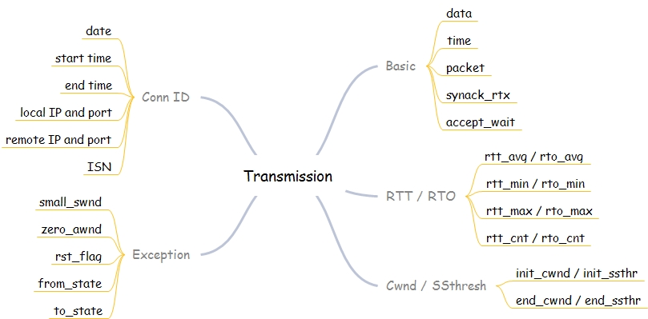
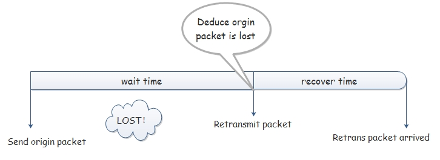
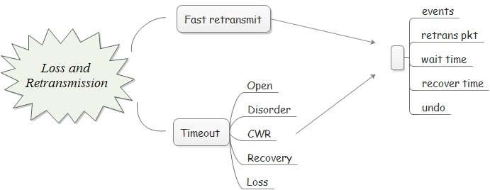
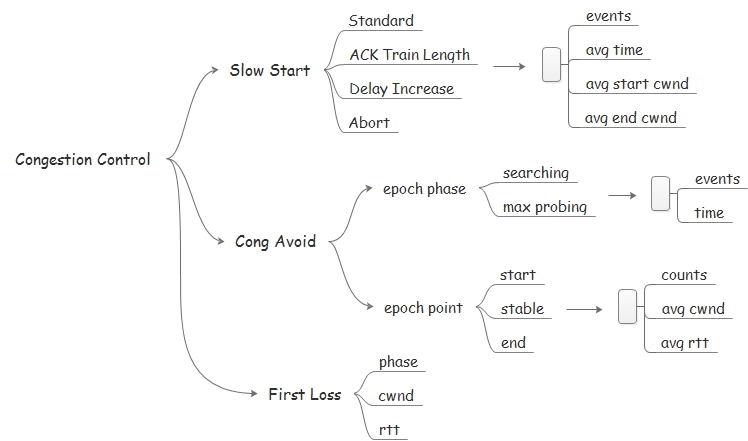
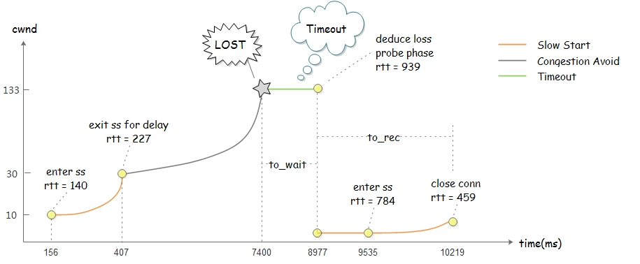
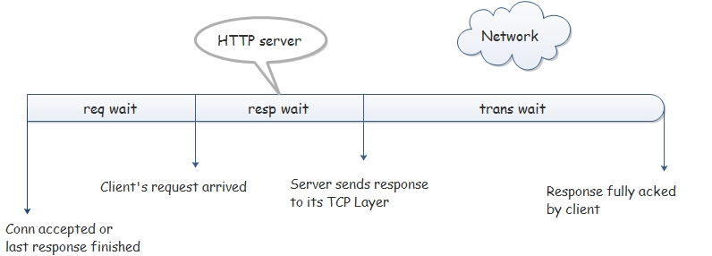
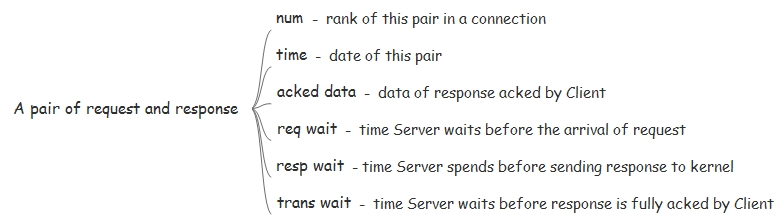
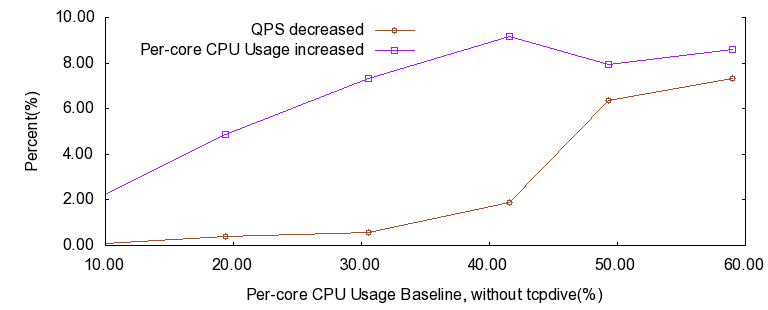
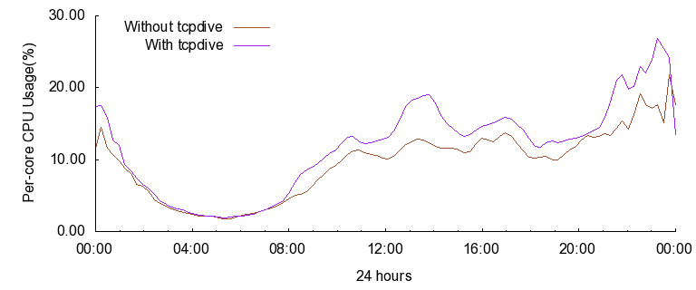

# [tcpdive](https://github.com/fastos/tcpdive) - A TCP performance profiling tool

Table of Contents
-----------------------------------------
* [Introduction](#introduction)
	* [Background](#background)
	* [Advantages](#advantages)
	* [Scenarios](#scenarios)
* [Functionality](#functionality)
	* [Transmission](#transmission)
	* [Loss and Retransmission](#loss-and-retransmission)
	* [Congestion Control](#congestion-control)
	* [HTTP Processing](#http-processing)
* [Usage](#usage)
  * [Kernel Version](#kernel-version)
  * [Packages](#packages)
  * [Quick Start](#quick-start)
  * [Full Guide](#full-guide)
* [Performance](#performance)
  * [Lab](#lab)
  * [Online](#online)
* [Contact](#contact)

## INTRODUCTION ##

#### Background ####

Over the last decade, network conditions have changed a lot due to the rapid evolvement
and popularity of some technologies such as Mobile Networking(2G/3G/4G/WiFi), 
Cloud Computing and etc. However, as the most commonly used transport layer protocol, 
TCP is not designed to deal with such complicated scenarios. As a result, some companies 
have been optimizing TCP to achieve a better user experience. 

However, when it comes to TCP performance optimization, we may be disappointed to find that
there are few suited tools available. Utilities such as tcpdump, netstat and ss are
not focused on TCP protocol itself. They can provide few performance information
about TCP internals.

For the reasons mentioned above, we decided to develop tcpdive - a TCP performance
profiling tool. Tcpdive is designed to provide an insight into TCP, by monitoring
and analysing mass data collected from a running linux kernel. Based on systemtap, 
tcpdive requires no kernel modifications, which makes it easy to deploy and friendly
to use.

#### Advantages ####

Compared to existing tools, tcpdive has some advantages:
- Far more peformance information of TCP internals.
- Quantitatively evaluate the improvement of TCP performance.
- Describe the processing of HTTP in TCP layer, which is independent of HTTP Apps.
- Easy to deploy and friendly to use.

#### Scenarios ####

Tcpdive has been deployed in the production environment of SINA to:
- Accelerate the improvement of service quality for Weibo image.
- Accelerate the improvement of service quality for Weibo video.
- Compare the performance of TCP in wired and wireless networks.
- Characterise TCP traffic of different applications.

## FUNCTIONALITY ##

#### Transmission ####

Performance indicators listed below are used to describe a TCP connection's transmission.  
For the meaning of each performance indicator, please refer to [TRANSMISSION](doc/transmission.md).

#### Loss and Retransmission ####

TCP uses two primary mechanisms to detect and recover from losses.
- Fast retransmit, triggered by dupacks
- Timeout, triggered by timer

First is Fast retransmit, where TCP performs a retransmission of the missing segment after
receiving a certain number of duplicate ACKs. As a fall back, whenever fast retransmit is 
unsuccessful or when a sender does not receive enough duplicate ACKs, TCP uses the second 
mechanism where it waits for a duration of RTO before deducing that a segment is lost and
then performs retransmission.

Tcpdive can distinguish Fast retransmit and Timeout, figuring out how much time a connection
spends on each kind of retransmission mechanism. For the meaning of each performance indicator, 
please refer to [RETRANSMISSION](doc/retransmission.md).     
 

#### Congestion Control ####

Cubic is a TCP congestion control algorithm and the current default in Linux.    
As the name of the algorithm represents, the window growth function of Cubic is a cubic
function which consists of three components:
- The first is a concave where the window quickly ramps up to the window size before the last congestion event. 
- The middle is a plateau between the concave and convex which allows the window size to stabilize for a period of time.
- The last is the convex where it probes for more bandwidth rapidly. 

Tcpdive explores TCP's congestion control mainly through the design and implementation of Cubic.    
Performance indicators listed below are used to profile Cubic. For the meaning of each performance indicator, 
please refer to [CONGESTION](doc/congestion.md).

What if we want more animate profiling of Cubic other than some averaged performance indicators?
Tcpdive supports five kinds of critical points, by the use of which we can depict the fluctuation of a connection.
To figure out what messages a critical point can convey, please refer to [CONGESTION](doc/congestion.md).

#### HTTP Processing ####

As we all know, HTTP is a request-response based protocol. That means the client will initiate
a communication by sending a request and the HTTP server will respond back by sending a response.
While tcpdive is designed to profile the performance of TCP protocol, it can also be used to
monitor every http request and response. HTTP Keep-Alive is suppported. 

For a pair of http request and response, performance indicators listed below are provided.

Tcpdive can profile HTTP processing in some degree, as illustrated above.    
Note that all the work is done in TCP Layer, which means it is independent of HTTP applications.

## USAGE ##

#### KERNEL VERSION ####

Although no kernel modification is required, tcpdive itself is kernel version dependent.    
Now tcpdive is developed on **kernel 2.6.32-431.17.1** of CentOS 6.5 which is the major system of
our production environment. More kernel versions will be supported in the future.
So check your kernel version first.     
If you don't have this version of kernel, please download related kernel rpms from [here](http://vault.centos.org/6.5/updates/x86_64/Packages/).

#### PACKAGES ####

For a quick start, only **systemtap-runtime** is required.    
To make full use of tcpdive, some extra packages are required:
- gcc
- elfutils
- systemtap
- kernel-devel
- kernel-debuginfo
- kernel-debuginfo-common

Use rpm command to install gcc, elfutils and systemtap if they don't exist.    
Kernel-debuginfo and kernel-debuginfo-common packages of this kernel version can be
downloaded from [here](http://debuginfo.centos.org/6/x86_64/).

#### QUICK START ####

Install tcpdive-2.6.32-431.17.1.el6-1.0-stable.x86_64.rpm in [rpm](rpm/).    
Modify /usr/bin/tcpdive to change default configuration.

    LOG_NAME="tcpdive.log"         # log file name
    LOG_SIZE="500"                 # per log file's upper size(MB)
    LOG_NUM=20                     # max number of log files
    PORTS="80"                     # server ports concerned, eg. 80,8080

Let's get tcpdive to work.

    tcpdive {start|stop|status}

After running "tcpdive start", you will find a log in current directory.
For every single line in the log, it represents a TCP connection which is profiled from 
multiple dimensions such as Transmission, Loss and Retransmission, and HTTP Processing.
For the default log format of tcpdive, please refer to [LOG](doc/log.md).

#### FULL GUIDE ####

To make full use of tcpdive, some flexible and constomized ways of usage are suggested.    
Make sure [packages](#packages) are already installed.

Run "./tcpdive.sh -h" to see the help information of tcpdive.    
Note that there are two kinds of log formats supported, check [LOG](doc/log.md) for more details.

    USAGE:
      ./tcpdive.sh [options] [modules] [filters]

    OPTIONS:
      -h            # show help
      -V            # show version
      -v            # verbose mode for debugging
      -t <sec>      # stop itself after running specified time
      -m            # compile as tcpdive.ko instead of running directly
      -d            # detailed logging instead of default format
        
    MODULES:
      -L            # Loss and Retransmission
      -H            # HTTP Performance (1.0/1.1)
      -C            # Congestion Control
      -A <num>      # Advanced CC (depict <num> critical points)
      -R            # Monitor Reset Packet
        
    FILTERS:
      -l <msec>     # lifetime of connection should greater than <msec>
      -i <msec>     # trans time of response should greater than <msec>
      -s <num>      # take one sample from <num> connections
      -p <ports>    # server ports cared, use comma to separate
        
      -f <laddr>:<lport>-<raddr>:<rport> [-f <...>] # should be last
         eg. -f *.*.*.*:80-10.210.136.*:*

**1. RUN DIRECTLY**

Compile and run directly, use Ctrl+C to stop if -t option is not specified.
Below are some examples.

    ./tcpdive.sh -L -t 60                     // or
    ./tcpdive.sh -d -L -H -p 80               // or
    ./tcpdive.sh -v -L -H -C -f *.*.*.*:8080-10.210.136.*:*

**2. MODULE WAY**

By specifying -m option, we can get a module named tcpdive.ko instead of running directly.

    ./tcpdive.sh -L -t 60 -m                  // or
    ./tcpdive.sh -d -L -H -p 80,8080 -m       // or
    ./tcpdive.sh -v -L -H -C -R -A 10 -m
    
Load tcpdive.ko and run tcpdive in background.

     staprun -D -o log tcpdive.ko             // or
     staprun -D -S 500,20 -o log tcpdive.ko port_str="80,8080"
     
To stop the running of tcpdive, use the following command.

    ps aux|grep stap|grep tcpdive|grep -v grep|awk '{print $2}'|xargs kill

**3. RPM WAY**

To deploy tcpdive in production environment, use [make_rpm.sh](script/make_rpm.sh) to 
configure and make rpm package.

    sh script/make_rpm.sh

After installing the rpm, a convenient way of usage is available.

    tcpdive {start|stop|status}

## PERFORMANCE ##

We evaluate tcpdive mainly by comparing the usage of system resources with and without it.    
While tcpdive does increase the CPU usage to some degree, it has no significant influence on 
other system resources. Commonly used functionalities of tcpdive such as Transmission, Loss and 
Retransmission, and HTTP Processing are enabled in the following tests.

#### LAB ####

Brief configuration of Nginx:
- Worker number is set to the number of CPU cores, which is 12 in our testbed.
- HTTP keep-alive is disabled for a short connection test.

10-Gigabit network cards are used with their tx/rx queues bound.
Http_load running on client fetches a 1KB file from Nginx with different degrees of concurrency to
vary the CPU load of server.

Here's a figure to demonstrate the increment of Per-core CPU Usage and the decrement of QPS induced 
by tcpdive under different circumstances.

The figure above shows Per-core CPU consumption of tcpdive is less than 10% while QPS is no significant 
influenced, which we believe is acceptable in most cases. However, on condition that Per-core CPU usage
is already very high (greater than 60%), the use of tcpdive is not recommended because QPS will drop a 
lot to make room for tcpdive.

#### ONLINE ####

As mentioned before, tcpdive has already been deployed in the production environment of SINA.    
One typical scenario is using tcpdive on HAProxy server which acts as the load balancer of image service.    
The figure below shows the fluctuation of Per-core CPU usage of a 24-core server within 24 hours.     
Two 10-Gigabit network cards are used with their tx/rx queues bound. 

Based on months observation, we make a conclusion that tcpdive is stable and robust enough to be 
deployed in the production environment.

## CONTACT ##

Blog: [zhangskd.com](http://zhangskd.com)    
Email: zhangskd@gmail.com

If you have any questions, please leave a message on my blog or email me. 
